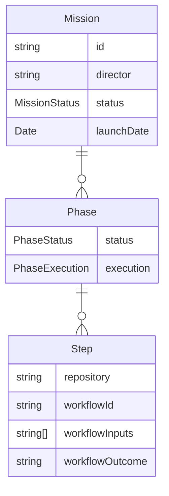

# liftoff/domain

The domain model of Liftoff.

## Models

```mermaid
erDiagram
    Mission {
        string id
        string director
        MissionStatus status
        Date launchDate
    }

    Phase {
        PhaseStatus status
        PhaseExecution execution
    }

    Step {
        string repository
        string workflowId
        string[] workflowInputs
        string workflowOutcome
    }

    Mission ||--o{ Phase : " "
    Phase ||--o{ Step : " "
```
